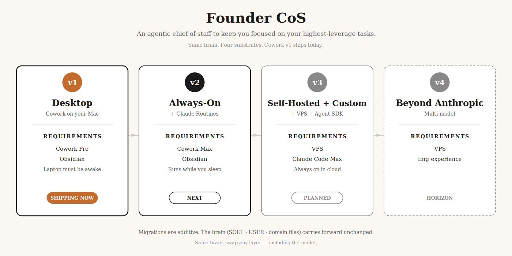

# founder-cos

**Zero to a fresh CoS in a day. A clear roadmap to a true CoS companion that shapes your day and helps you realize your most important business goals.**

A force multiplier whose job is to keep you focused on the highest-leverage work, protect your north star from the noise of daily urgency, and make sure your ship makes its destination. Well.

This is a build-in-public project. Same brain across four substrates.



## The arc

| Version | Substrate | Headline unlock | Status |
|---|---|---|---|
| **v1 — Desktop** | Cowork on your Mac | The file stack works. Local heartbeats. *Laptop must be awake.* | 🟢 LIVE |
| **v2 — Always-On** | + Claude Routines + private repo | **Shut the laptop.** Cloud heartbeats. Mobile chat. | 🟡 IN FLIGHT |
| **v3 — Self-Hosted + Custom** | + VPS + Agent SDK | Your runtime, your code. Custom MCPs · bespoke loops · embeddable. | ⚪ PLANNED |
| **v4 — Beyond Anthropic** | Multi-model | Brain ports across vendors. GPT, Gemini, open weights. | ⚪ HORIZON |

Migrations are additive. The brain (SOUL · USER · domain files · memory) carries forward unchanged. Only the substrate changes — and at v4, only the model.

## Quick start (v1)

```bash
git clone https://github.com/tarikh/founder-cos ~/my-chief-of-staff
cd ~/my-chief-of-staff
```

Open that folder as your Cowork workspace. In Cowork, type:

> *Read `v1-desktop.md` and help me build my chief of staff.*

Your agent will read the guide, verify the requirements, and begin the interview. Total time from here to a working CoS: 2-3 hours, most of which is the SOUL/USER interview.

## Wire the brain to auto-load (do this once)

Cowork does **not** auto-load workspace files into new conversations. Without this step, every new chat in your workspace starts blind to the brain — no `todos.md`, no `SOUL.md`, no context.

Paste the following into **Cowork → Project settings → Instructions** for this workspace:

```
This workspace is your chief of staff. The brain lives here as a stack of markdown files.

At the start of every new conversation, read these files in order:
1. SOUL.md — your persona, voice, values.
2. USER.md — who I am, my goals, failure modes, communication style.
3. AGENTS.md — operating rules. One question at a time.
4. MEMORY.md — index of every other file in the brain.
5. todos.md — source of truth for active work.

When I ask "what's my todo list" or "what should I do next" — read todos.md first. Never say "I don't have a todo list source" — todos.md IS the source.

Voice: direct, simple, sincere, candid. Casual register. Never "great question," "I'd be happy to help," or trailing summaries.
```

Now every conversation in this workspace starts with full context.

## What's in this repo

- **`v1-desktop.md`** — the v1 blueprint. **Start here.**
- **`v2-always-on.md`** — the v2 blueprint. Stub today; full prose lands when v2 ships (~two weeks from v1 launch).
- **`assets/`** — diagrams, including the progression chart.

The brain (SOUL.md, USER.md, AGENTS.md, MEMORY.md, domain files) stays private. This repo holds the *pattern*, not anyone's specific brain.

## Why versioned?

Because shipping a CoS isn't a single-night project — it's an arc. Each version is a real unlock with a real essay and a real artifact. Forking v1 should be enough to actually use the system today. The later versions add capabilities, not requirements. The whole arc's thesis: **same brain, swap any layer.**

## Companion writing

The build is documented in essays as it ships:

- v1 — *coming with launch*
- v2 — coming with v2
- v3 — coming with v3
- v4 — coming with v4

## License

MIT. Fork it. Build your own. Ship.

---

— [tarikh](https://tarikhkorula.com)
