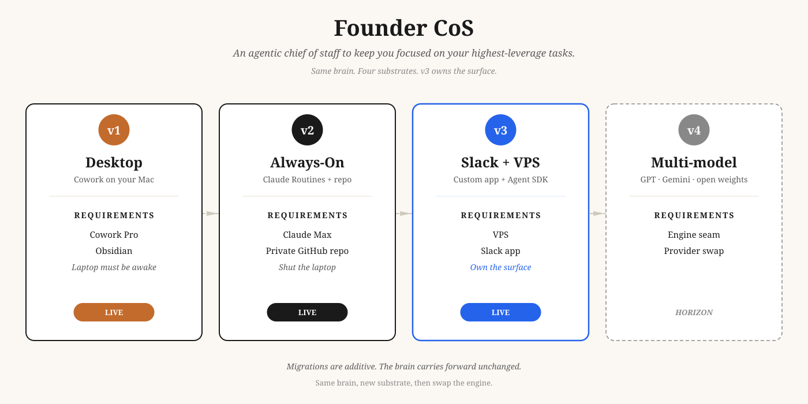

# founder-cos

**Zero to a fresh CoS in a day. A clear roadmap to a true CoS companion that shapes your day and helps you realize your most important business goals.**

A force multiplier whose job is to keep you focused on the highest-leverage work, protect your north star from the noise of daily urgency, and make sure your ship makes its destination. Well.

This is a build-in-public project. Same brain across four substrates: desktop, always-on cloud heartbeats, self-hosted Slack runtime, then multi-model portability.



## The arc

| Version | Substrate | Headline unlock | Status |
|---|---|---|---|
| **[v1: Desktop](v1-desktop.md)** | Cowork on your Mac | The file stack works. Local heartbeats. *Laptop must be awake.* | 🟢 LIVE |
| **[v2: Always-On](v2-always-on.md)** | Claude Routines + private repo | **Shut the laptop.** Cloud heartbeats. Mobile chat. | 🟢 LIVE |
| **[v3: Slack + VPS](v3-slack-vps.md)** | Custom Slack app + VPS + Agent SDK | **Own the surface.** Phone-first interactive CoS. Runtime you control. | 🟢 LIVE |
| **v4: Multi-model** | Multi-model behind the same surface | Brain ports across vendors. GPT, Gemini, open weights. | ⚪ HORIZON |

Migrations are additive. The brain (SOUL · USER · domain files · memory) carries forward unchanged. Only the substrate changes — and at v4, only the model.

## Quick start (v1)

```bash
git clone https://github.com/tarikh/founder-cos ~/my-chief-of-staff
cd ~/my-chief-of-staff
```

Then, in this order:

1. **Open the folder as your Cowork workspace.**
2. **Connect your tools.** Wire up Gmail, Google Calendar, Slack, and Google Docs via Cowork's built-in connectors. No code, no terminal — just OAuth flows. The CoS uses these to read your real schedule, your real correspondence, your real working context. Without them it's a clever filing cabinet; with them it's a chief of staff.
3. **Wire the brain to auto-load** (one-time, see next section).
4. **Kick off the interview.** In Cowork, type: *Read `v1-desktop.md` and help me build my chief of staff.*

Total time from here to a working CoS: 2-3 hours, most of which is the SOUL/USER interview.

## Wire the brain to auto-load (do this once)

Cowork does **not** auto-load workspace files into new conversations. Without this step, every new chat in your workspace starts blind to the brain — no `todos.md`, no `SOUL.md`, no context.

Paste the following into **Cowork → Project settings → Instructions** for this workspace:

```
This workspace is your chief of staff. The brain lives here as a stack of markdown files.

At the start of every new conversation, read these files in order:
1. SOUL.md — your persona, voice, values.
2. USER.md — who I am, my goals, failure modes, communication style.
3. AGENTS.md — operating rules. One question at a time.
4. MEMORY.md — index of every other file in the brain.
5. todos.md — source of truth for active work.

When I ask "what's my todo list" or "what should I do next" — read todos.md first. Never say "I don't have a todo list source" — todos.md IS the source.

Voice: direct, simple, sincere, candid. Casual register. Never "great question," "I'd be happy to help," or trailing summaries.
```

Now every conversation in this workspace starts with full context.

## Upgrade to v2 (when your laptop being asleep starts to hurt)

Once v1 is running and you feel the laptop-must-be-awake constraint, v2 takes about 30-90 minutes:

1. Move your brain folder out of `~/Documents/` (TCC blocks background sync otherwise).
2. Push the folder to a private GitHub repo.
3. Wire a 5-minute local auto-sync via launchd or cron.
4. Configure your four heartbeat tasks as Claude Routines at `claude.ai/code/routines`, pointed at the repo.
5. Verify each Routine writes back to the repo and posts to your messaging channel.

The brain doesn't change. Same SOUL.md, same USER.md, same domain files. Only the substrate moves. Full step-by-step in `v2-always-on.md`, including the operational gotchas (PR-mode default on GitHub MCP commits, GPG-signing surprise, OAuth token expiry, fail-loud discipline). Read those before you start — each one costs an hour to discover from scratch.

## Upgrade to v3 (when the interactive surface starts to hurt)

v2 makes the chief of staff always-on. v3 makes it reachable where the work is already happening.

Upgrade to v3 when the interaction layer becomes the constraint: re-tagging rituals, hosted bot fragility, needing your CoS in Slack threads, wanting custom code, wanting fail-loud writes, or wanting a runtime you can restart yourself.

The brain still doesn't change. The private repo remains the source of truth. v3 adds a custom Slack app, a VPS worker, Agent SDK sessions per Slack thread, and a serialized git writer that owns capture/write-back. Full step-by-step in `v3-slack-vps.md`; the reference worker lives at [`tarikh/cos-slack-worker`](https://github.com/tarikh/cos-slack-worker).

## What's in this repo

- **`v1-desktop.md`** — the v1 blueprint. **Start here.**
- **`v2-always-on.md`** — the v2 blueprint. Cloud heartbeats via Claude Routines, brain in a private GitHub repo, shut the laptop and the system keeps running.
- **`v3-slack-vps.md`** — the v3 blueprint. Custom Slack app, VPS worker, Agent SDK, same private brain repo, serialized git writer, fail-loud ops. Reference implementation: [`tarikh/cos-slack-worker`](https://github.com/tarikh/cos-slack-worker).
- **`assets/`** — diagrams: progression chart, v1 file stack, v1 quickstart, v2 wiring, v3 stack, and v2→v3 comparison.

The brain (SOUL.md, USER.md, AGENTS.md, MEMORY.md, domain files) stays private. This repo holds the *pattern*, not anyone's specific brain.

## Why versioned?

Because shipping a CoS isn't a single-night project — it's an arc. Each version is a real unlock with a real essay and a real artifact. Forking v1 should be enough to actually use the system today. The later versions add capabilities, not requirements. The whole arc's thesis: **same brain, swap any layer.**

## Codex note

Codex was a v2.6 parallel-run experiment: same markdown brain, same operating rules, same task loops, different model/runtime. It clarified the portability thesis, but v3's forward surface is the custom Slack + VPS runtime. The point is not model fandom. It is learning which deployment patterns survive across tools.

## Companion writing

The build is documented in essays as it ships:

- v1 — https://tarikhkorula.com/wisdom/founder-cos-v1-cowork-edition/
- v2 — https://tarikhkorula.com/wisdom/cos-v2-cloudy-visions
- v3 — drafting
- v4 — coming with v4

## License

MIT. Fork it, build your own, ship.

---

— [tarikh](https://tarikhkorula.com)
