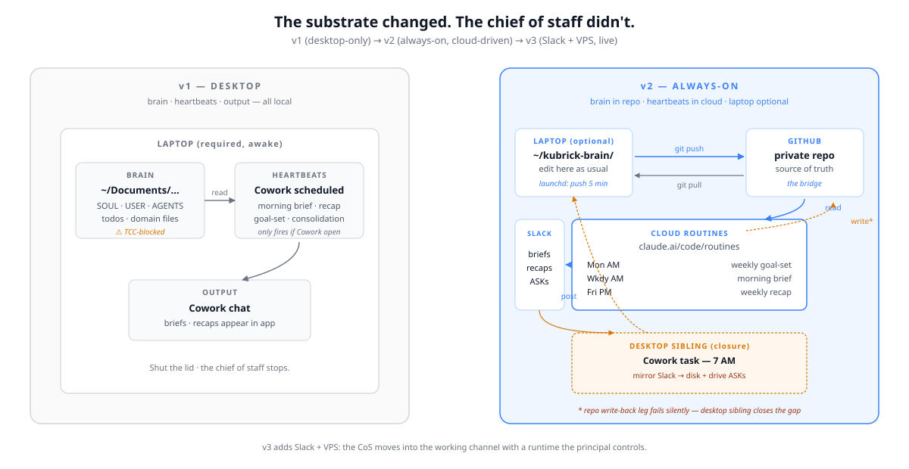
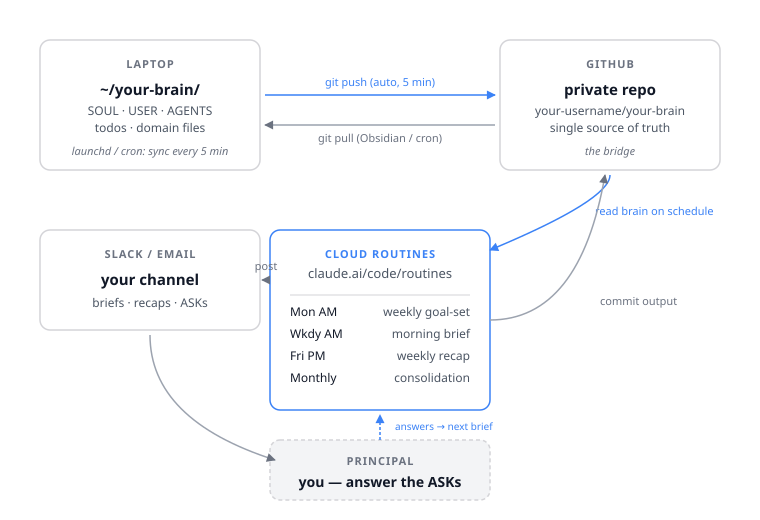
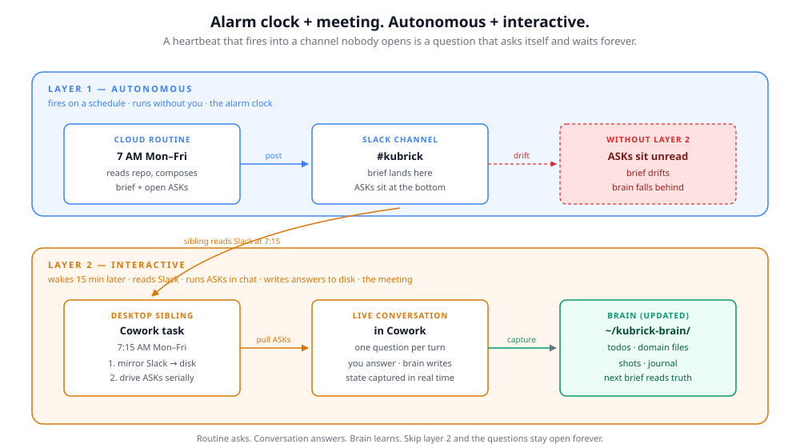

# The Founder's Chief-of-Staff Stack
### Always-On Edition — heartbeats in the cloud, brain in a private repo

*Companion essay: [CoS v2 — Cloudy Visions](https://tarikhkorula.com/wisdom/cos-v2-cloudy-visions). Twelve scenes from cutting the system loose from the desktop and learning what running it from Anthropic's cloud actually entails. This document is the blueprint; the essay is the why.*

---

## What v2 unlocks

The single thing v1 can't do: **fire heartbeats while your laptop is asleep.**

v2 fixes that. Your chief of staff lives in the cloud. Morning briefs land in Slack whether or not your Mac is on. You can chat with the same brain from your phone via claude.ai/code. Travel days, weekends, vacation — the system keeps running.



---

## What changes from v1

The brain — SOUL.md, USER.md, AGENTS.md, MEMORY.md, domain files — **does not change.** The migration is additive.

What changes:

- **Brain lives in a private GitHub repo.** Your laptop auto-syncs to it every five minutes; the cloud agent reads from it.
- **Heartbeats run as Claude Routines** on Anthropic-managed infrastructure. Cron-like scheduling, no laptop dependency.
- **Mobile chat** via claude.ai/code in your phone browser, against the same brain.

What does NOT change:

- The file stack and load order. SOUL.md → USER.md → AGENTS.md → MEMORY.md → domain files, every conversation.
- The socratic protocol. One question at a time.
- Cowork as your primary interactive surface. Routines run in the background; Cowork is still where you sit and work.

---

## Requirements (in addition to v1)

- **Claude Max plan or higher.** Routines per-day caps: Pro 5, Max 15, Team/Enterprise 25. The four core heartbeats (morning brief, weekly goal-set, weekly recap, monthly consolidation) need 4-5/day, with headroom on Max for event-driven briefings.
- **A GitHub account.** You'll create a private repo for the brain.
- **Terminal comfort.** You'll write a shell script, configure launchd, and audit `git config`. v2 is not a no-CLI version of v1. If terminal scares you, stay on v1.
- **30-90 minutes** for the migration, plus the operational gotchas. Read this whole document before you start — each gotcha costs an hour to discover from scratch.

---

## Architecture



Two halves:

**Desktop side** — the brain folder, auto-synced to GitHub every five minutes via a launchd job. You edit locally; the sync pushes; the cloud Routines read.

**Cloud side** — four Claude Routines (one per heartbeat), scheduled in the Routine UI at `claude.ai/code/routines`, each pointed at the repo via the GitHub MCP. The Routine fires, reads brain files, composes its output, posts to Slack, and *writes back to the repo* (the last step is where most of the gotchas live — see below).

Both halves are necessary. Either one alone is half a system.

---

## Migration steps

The migration assumes v1 is already running — you have a working brain folder, the file stack, and the heartbeat tasks configured in Cowork. v2 is the substrate swap.

### 1. Move the brain out of `~/Documents/`

Modern macOS protects `~/Documents/` from background automation by default. Terminal has access because you granted it; **launchd does not inherit that grant**, and there's no UI to fix it (Full Disk Access only accepts signed `.app` bundles now).

If your brain lives in `~/Documents/...`, automated commits will fail with `Operation not permitted` and you'll burn an hour debugging permissions before realizing the path is the problem.

```bash
mv ~/Documents/my-chief-of-staff ~/kubrick-brain
```

`~/` is fine. `/opt/` is fine. A dedicated workspace folder outside protected user folders is fine. `~/Documents/`, `~/Desktop/`, and `~/Downloads/` are not.

### 2. `git init` and push to a private GitHub repo

Standard flow:

```bash
cd ~/kubrick-brain
git init
git add -A
git commit -m "initial brain"
# create a private repo at github.com/<you>/kubrick-brain
git remote add origin git@github.com:<you>/kubrick-brain.git
git push -u origin main
```

Decide your `.gitignore` strategy before pushing. Most domain files belong in the repo. Sensitive subdirs (financial detail, anything that can't risk a future leak) can be excluded. The brain stays private — only you and the Routine connector see it.

### 3. Wire the five-minute auto-sync via launchd

Write a tiny shell script:

```bash
#!/bin/bash
cd ~/kubrick-brain && git add -A && git commit -m "auto-sync" --allow-empty && git push
```

And a launchd plist that runs it on a five-minute interval. The plist goes in `~/Library/LaunchAgents/`, and `launchctl load` activates it.

**Gotcha — audit `git config` first.** Globally-set options break automation silently. The most common offender is `commit.gpgsign=true`: Terminal has the GPG agent in scope, launchd doesn't. Commits start, acquire `.git/index.lock`, fail mid-flight on the signature step, and leave a stale lock behind that blocks every subsequent commit. The symptom looks like a race condition but it's a single process half-finishing twice. Fix:

```bash
cd ~/kubrick-brain
git config commit.gpgsign false   # local override; keep your global setting if you want
```

Other settings to audit while you're there: credential helpers, commit hooks, anything that assumes an interactive terminal.

### 4. Configure the four cloud Routines

Go to `claude.ai/code/routines`. Create one Routine per heartbeat:

- **Morning brief** — weekdays, 6-7 AM local.
- **Weekly goal-set** — Mondays, 7 AM.
- **Weekly recap** — Fridays, 4-5 PM.
- **Monthly consolidation** — 1st of month, 10 AM.

Each Routine needs:

- **The GitHub MCP connector** wired to your brain repo (read + write).
- **A messaging connector** for the output channel — Slack is the easiest.
- **A prompt** of 50-150 lines that reads the brain files, composes the output, posts it, and commits the result back to the repo.

The prompts are the program. Version them. Keep them in `routines/` in the brain repo, dated. You will rewrite each one five or six times before it works the way you want — that's normal. There's no debugger and no log file; the only signal is the output posted to Slack.

### 5. Wire the desktop sibling task

This is the step most people miss. **It is load-bearing.** Skip this step and the system breaks in two specific ways:

**Failure mode A — silent write-back.** The cloud Routine reliably posts its output to Slack but the repo write-back leg fails silently. The GitHub MCP available in cloud Routines runs in PR-creation mode by default, which is wrong for unattended single-user write-back. The Routine returns success because every call it made returned cleanly; the file just never landed on disk. The next morning's brief reads yesterday's file, finds it absent, and rebuilds from assumptions.

**Failure mode B — the question that asks itself.** The Monday goal-set Routine fires at 7 AM and posts a second-person prompt to Slack: *"what are the two or three most important things to move forward this week?"* If you don't open Slack, the question sits unread. The Routine did its job — it asked. That's not the same as the question getting answered. The week never gets a goals file.

The fix for both is a sibling Cowork task on the desktop, scheduled 15 minutes after the cloud Routine fires:



The sibling task:
- Reads the Slack channel where the cloud Routine posted.
- Writes the file to disk using local file tools (which work reliably, unlike the cloud MCP's write-back).
- For any ASKs in the output, pulls them into a live Cowork conversation with you — one question at a time.

Two layers. The Routine is the alarm clock. The conversation is the meeting. Both have to be wired.

---

## The five operational gotchas (consolidated)

If you take nothing else from this document:

1. **macOS TCC blocks `~/Documents/`** from background automation. Move the brain out before wiring launchd. (Step 1.)
2. **`commit.gpgsign=true` breaks launchd commits** and leaves stale locks behind. Audit `git config` before you trust any auto-sync. (Step 3.)
3. **GitHub MCP defaults to PR-creation mode** in cloud Routines. The repo write-back fails silently. Build a desktop sibling that handles file writes locally. (Step 5, failure mode A.)
4. **An autonomous heartbeat without an interactive answer-side is a question that asks itself and waits forever.** The Routine asks; something has to drive the answer. (Step 5, failure mode B.)
5. **Routines confidently re-assert yesterday's claims** about state that has since changed. The first day this matters, the morning brief will surface 8 of 10 closed ASKs as still open — *"5th brief without an answer," "since 5/8, ~8th brief, protocol failure signal"* — confident, structured, wrong. The Routine rolled yesterday's output forward as scaffold instead of re-reading current brain state. **Fix lives in the prompt:** for every ASK the brief is about to surface, grep the `Done` section of `todos.md` AND the recent `journal/` entries for a closing capture; if found, skip with a one-line note; if not, surface. Default to uncertainty about your own previous outputs. *Pre-read on disk does not equal happened. Listed as open in yesterday's brief does not equal still open today.*

Smaller things you'll discover along the way: OAuth tokens expire and need re-grant; Routine prompts need version control because the UI has no history (keep them in `routines/` in the repo, dated); Slack-side rate limits if you cross-post heavily. The five above are the load-bearing ones.

---

## Three disciplines that fall out of running v2

v1 lived inside a single Cowork conversation; the brain was in the room, and most state changes happened *as* writes. v2 runs across conversations, across the cloud, across substrates. The brain stays the source of truth only if you actively keep it that way. Three disciplines hold the line.

**Delta, not state.** The daily artifact (your morning brief) should foreground what moved, not re-render the full picture every morning. State has source files — `north-star.md`, `priorities.md`, the week's goal file. The daily view is for delta: what shipped yesterday, what's on for today, what's drifting. A brief that re-renders the full compass burns your attention on things you already know.

**Brain is a runtime log, not an end-of-day archive.** Every state change — what you stated, what an agent executed, what the two of you decided in chat — hits disk *before the next message*. Not at end of session. Not in a batch. In-turn. Without this, a fresh conversation opening hours later reads a brain that's behind reality, and the next brief compounds the wrong state.

**Ask, don't label.** Heartbeats can label uncertainty (ASK, pending, unverified) but labels are filing, not asking. Every open ASK gets rewritten in the prompt as a direct second-person question — *"Did X happen?"* not *"X status: unverified."* The Routine asks; the sibling task drives the answer to disk.

These aren't optional. The v2 substrate exposes the loop that v1's single-conversation shape used to close implicitly. Active writes on one side, active asks on the other.

---

## Tradeoffs, stated plainly

- **Routines is a research preview** as of May 2026. The product will keep changing. Prompts you tune today may need re-tuning when the underlying behavior shifts.
- **Per-day Routine caps are real** and will bite if you outgrow the four core heartbeats with many event-driven tasks. Max's 15/day gives you headroom; Pro's 5 doesn't.
- **No custom code.** Cloud Routines run in a sandboxed runtime with MCP connectors and a prompt. Anything beyond what an MCP exposes, you can't do in v2. (That's v3.)
- **No multi-model.** Routines run on Anthropic's models. (That's v4.)
- **Cowork is still your primary interactive interface.** v2 doesn't replace it; it adds an always-on layer behind it.

---

## When v2 isn't enough → v3

If you hit the Routine per-day caps repeatedly, want to write custom code that runs alongside the prompts, need MCP connectors that don't exist yet, or want messaging surfaces beyond what's available — [v3](v3-slack-vps.md) is the next step. Slack app, VPS, Agent SDK, your runtime, your code.

The brain doesn't change. The substrate does.

---

— [tarikh](https://tarikhkorula.com)
