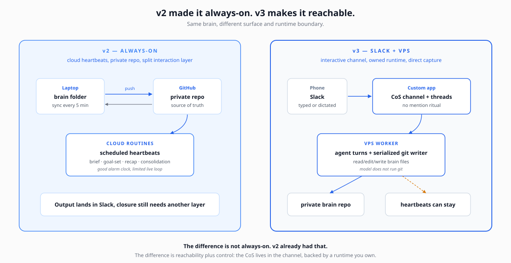
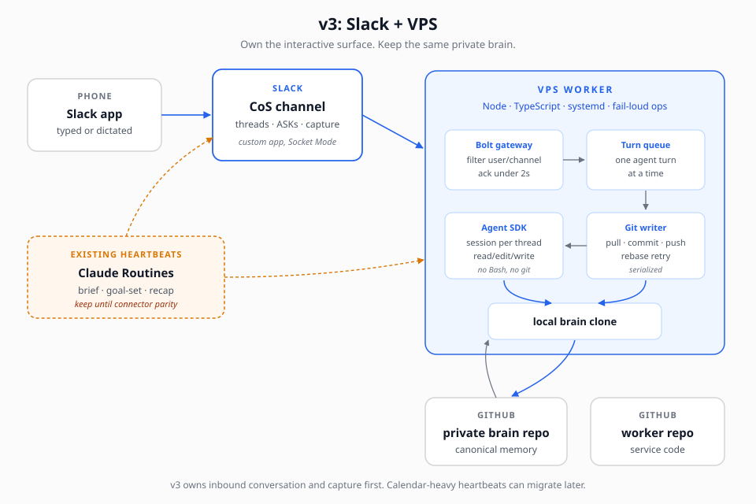

# The Founder's Chief-of-Staff Stack
### Slack + VPS Edition - own the surface

*Companion essay: [Founder CoS v3: Portable, Mobile, Interactive](https://tarikhkorula.com/wisdom/founder-cos-v3-portable-mobile-interacive). This document is the blueprint; the essay is the why.*

Reference implementation:
[`tarikh/cos-slack-worker`](https://github.com/tarikh/cos-slack-worker).

---

## What v3 unlocks

v2 made the chief of staff always-on. v3 makes it reachable where the work is already happening.

The single thing v2 still could not fully solve: **the interactive surface.**

Cloud Routines can post morning briefs, weekly goal-sets, recaps, and consolidations. They are good alarm clocks. But a chief of staff is not only an alarm clock. You need to answer its ASKs, capture state changes, ask follow-ups, and close loops in the same place the work is happening.

v3 moves that interactive loop into Slack.



The unlocks:

- **Phone-first interaction.** Talk to the CoS from Slack, not a special app you have to remember to open.
- **No mention ritual.** A message in the CoS channel is enough; a leading `.` can mute the worker when needed.
- **Thread-native context.** Replies under a brief or ASK happen in the same thread that created the question.
- **Captures write back to the brain.** If the system says it captured something, it should land in the private repo.
- **Runtime control.** The worker runs on your VPS, under your systemd unit, with your restart policy and your logs.
- **Fail-loud operations.** Errors post back to the channel instead of disappearing into a hosted integration.

This is not a beginner/no-code edition. Start with v1. Move to v2 when your laptop being asleep hurts. Move to v3 when the interaction layer starts to hurt.

---

## What changes from v2

The brain still does not change.

SOUL.md, USER.md, AGENTS.md, MEMORY.md, todos, domain files, daily briefs, weekly goals - the substance carries forward. The private GitHub repo remains the canonical brain. The file stack and operating rules remain the source of truth.

What changes:

- **A custom Slack app becomes the interactive surface.** Your CoS lives in a channel you already use.
- **A VPS worker owns inbound conversation.** Slack events flow to your server over Socket Mode.
- **Agent SDK sessions map to Slack threads.** Conversation continuity lives where the actual discussion lives.
- **A serialized git writer owns write-back.** The model edits files; the worker pulls, commits, rebases, retries, and pushes.
- **The worker fails loud.** systemd restarts it; an `OnFailure` hook can post to Slack if the service dies.

What may not change yet:

- **Scheduled heartbeats may still run as Claude Routines.** If your morning brief depends on Google Calendar and the VPS does not have that connector yet, keep that heartbeat on Routines until the connector is solved.
- **The model may still be Claude.** v3 is about surface and runtime ownership. v4 is where multi-model portability becomes the headline.

The boundary matters. Do not overclaim "everything runs on the VPS" if your calendar-dependent heartbeats still run in Routines. Say the true thing: v3 owns the interactive Slack runtime first.

---

## Requirements

In addition to a working v2 setup:

- **A private GitHub repo for the brain.** This remains the source of truth.
- **A service repo for the worker.** Keep code separate from the brain. The reference implementation is [`tarikh/cos-slack-worker`](https://github.com/tarikh/cos-slack-worker).
- **A VPS.** Linux, systemd, enough RAM for one Node process plus one agent turn. A small box is fine if traffic is personal.
- **Node 22 + TypeScript comfort.** The reference shape uses Bolt for Slack and the Claude Agent SDK.
- **Slack app admin access.** You need to create/install a custom app in your workspace.
- **A Claude Max plan or API-key fallback.** The reference build used a personal subscription token for scripts; an API key with a daily cap is the clean fallback.
- **GitHub deploy keys.** One key per repo if GitHub requires scoped deploy keys.
- **Terminal comfort.** You will edit env files, install a systemd unit, inspect logs, and run deploy scripts.
- **Optional dictation.** Wispr Flow, native phone dictation, or any speech-to-text tool turns Slack into a lightweight voice surface.

If terminal work scares you, stay on v2. v3 buys control by accepting more operational responsibility.

---

## Architecture



The reference shape:

**Slack side**

- A custom Slack app installed into the workspace.
- Socket Mode enabled, so the server opens an outbound websocket. No inbound port is required.
- Event subscriptions for the channel where the CoS lives.
- If the channel is private, use private-channel scopes/events. Public-channel subscriptions are not enough.

**VPS side**

- A Node/TypeScript worker.
- Bolt receives Slack events.
- A filter only accepts messages from the principal in the CoS channel.
- A global turn queue runs one agent turn at a time.
- Agent SDK sessions are persisted per Slack thread.
- The brain repo is cloned on disk and pulled before turns.
- The model can read/edit/write brain files through restricted tools.
- The model does not run Bash or git.
- A serialized writer owns pull/rebase/commit/push.
- systemd keeps the worker running and posts a visible failure notice if restart policy exhausts.

**GitHub side**

- Private brain repo remains canonical.
- Worker repo holds only service code.
- Deploy keys scope the box to the repos it needs.

**Existing heartbeat side**

- Claude Routines can keep running scheduled outputs until the VPS has connector parity.
- One substrate per heartbeat. Do not run the same morning brief in Routines and on the VPS at the same time unless you want duplicate briefs.

---

## Migration steps

These steps assume v2 already works.

### 1. Create the Slack app

Create a new Slack app from a manifest or from scratch.

Minimum pieces:

- Socket Mode enabled.
- Bot token with chat write and reaction scopes.
- App-level token for Socket Mode.
- Event subscriptions for messages in the CoS channel.
- If your CoS channel is private, add the private-channel scopes/events before testing.

Install the app to the workspace and invite it to the CoS channel.

### 2. Clone or scaffold the worker

The reference implementation is [`tarikh/cos-slack-worker`](https://github.com/tarikh/cos-slack-worker). Clone that if you want the tested shape; use the layout below if you are building your own variant.

Reference layout:

```text
src/index.ts        Slack app, event filter, ack, turn queue
src/agent.ts        Agent SDK sessions, model routing, prompt append
src/writer.ts       serialized git writer
src/threads.ts      thread_ts to session map
src/budget.ts       usage ledger and daily caps
src/slack-fmt.ts    markdown to Slack mrkdwn
src/config.ts       env and constants
deploy/             systemd units and deploy scripts
.env.example        names only, no real secrets
```

Keep the worker repo separate from the brain repo. The public pattern is easier to reason about when code and memory are not the same repository.

### 3. Prepare the VPS

On the box:

- Install Node 22.
- Clone the worker repo.
- Clone the private brain repo.
- Create an env file outside both repos.
- Add deploy keys for the repos the worker needs.
- Install the systemd unit.

Do not put real tokens in git. Do not pass secrets through shell history if you can avoid it. Pipe them into the env file or use your normal secret management path.

### 4. Start in echo mode

Before the model is involved:

- Send a message from your phone.
- Confirm the worker sees it.
- Confirm the worker filters only the right user/channel.
- Confirm the ack lands in under 2 seconds.
- Restart the service and verify it comes back.
- Kill the process and verify systemd restarts it.

If the echo worker is unreliable, the agent worker will be miserable.

### 5. Flip to read-only agent mode

Give the agent read-only access to the brain clone first.

Acceptance:

- Ask "what's open this week?"
- The answer should cite real brain state.
- It should reply in-thread.
- It should complete within about 30 seconds for normal questions.

No writes yet.

### 6. Enable captures

Now add edit/write tools and the serialized git writer.

The model edits files in the clone. The worker commits. That split is the security boundary.

Acceptance:

- Reply under a brief thread with a terse answer like `1 signed`.
- The worker maps that answer to the right ASK.
- The correct file changes.
- The commit lands on the private repo's main branch.
- Slack confirms only after the write actually lands.

If the file did not change, the system did not learn.

### 7. Cut over one voice

Once v3 is proven:

- Remove or mute the legacy hosted bot from the CoS channel.
- Keep one obvious voice in the channel.
- Leave scheduled Routines alone unless you are deliberately migrating those heartbeats too.

---

## Acceptance tests

Run these from your phone, because phone-first is the point.

- Plain message in the CoS channel gets an ack in under 2 seconds.
- Brain-grounded answer returns in under 30 seconds.
- Follow-up in the same Slack thread preserves context.
- Restart the service mid-thread; the next reply resumes correctly.
- Edit the brain from another machine; the next agent turn pulls fresh state.
- Terse ASK answer updates the correct todo or domain file.
- Capture lands on GitHub main, not just in a Slack claim.
- Concurrent local sync and worker write do not fight; writer rebases/retries.
- Force worker failure; Slack gets a visible failure notice.
- Ask "cost today?" or "usage today?" and get an answer from the local ledger without a model call.
- Trip the daily turn cap on purpose; the next turn fails loud.

Do not declare v3 live until the write-back test passes against the remote repo.

---

## Operational gotchas

If you take nothing else from this document:

1. **Hosted integrations can lose the binding that made them useful.** That is the origin story of v3. If a vendor-owned Slack integration no longer knows which repo is your brain, the surface is the weak link.
2. **Private Slack channels need private-channel scopes/events.** Public-channel events will leave your worker deaf in its own room.
3. **Wrong workspace / duplicate app / dead tokens is a real hour.** Verify the app, workspace, channel membership, and token set with API calls, not vibes.
4. **Do not let the model run git.** The worker owns git. Pull, rebase, commit, push, retry, and stale-lock cleanup should be deterministic code.
5. **Tool restriction has to be structural.** Do not assume auto-approval settings remove tools from the model. Restrict the base tool set and explicitly disallow dangerous tools.
6. **Test on the target box.** Local Node architecture problems can send you debugging the wrong machine.
7. **Run one agent turn at a time until you have a reason not to.** For a personal CoS, a global queue is simpler and caps RAM.
8. **Fail loud.** Slack should see errors, rate limits, budget stops, and worker death. Silence is how brain state rots.
9. **One voice in the channel.** Once the custom app is live, remove or mute legacy bots.

---

## What v3 does not include yet

This edition does not automatically solve:

- Full heartbeat migration off Claude Routines.
- Google Calendar access from the VPS.
- Gmail/Drive/Slack connector parity with hosted environments.
- TTS or Slack audio transcription.
- Team/multi-user permissioning.
- Multi-model routing.

Those are real, but they are not required for the v3 unlock. v3 is the interactive Slack runtime. Heartbeats can migrate later.

---

## When v3 is enough

v3 is enough when your main problem is surface/runtime ownership:

- You want the CoS in Slack.
- You want a worker you control.
- You want custom code around the agent turn.
- You want captures to commit directly to the brain.
- You want failure visibility.

v4 begins when the next seam is the engine.

If the brain, Slack surface, git writer, schedule, and delivery layer all survive, swapping Claude for GPT, Gemini, or open weights becomes a narrower problem. Not trivial. Narrower.

The brain carries forward. The substrate changes.

---

— [tarikh](https://tarikhkorula.com)
